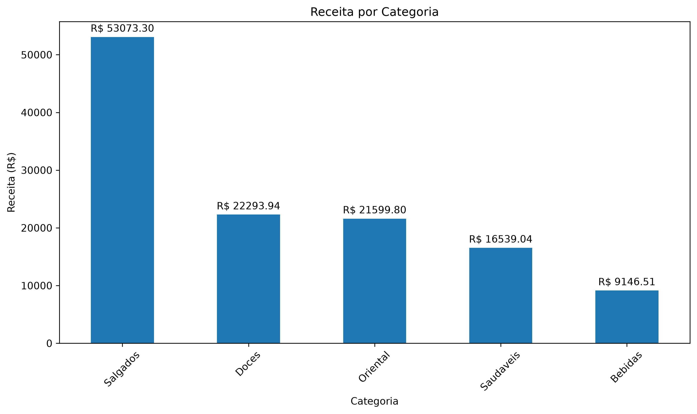
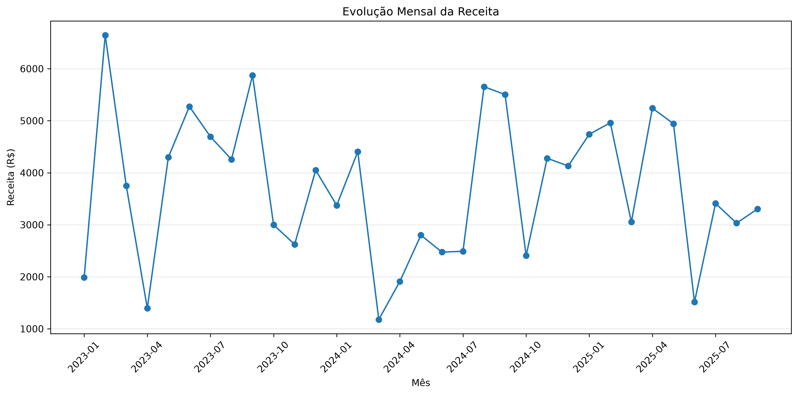
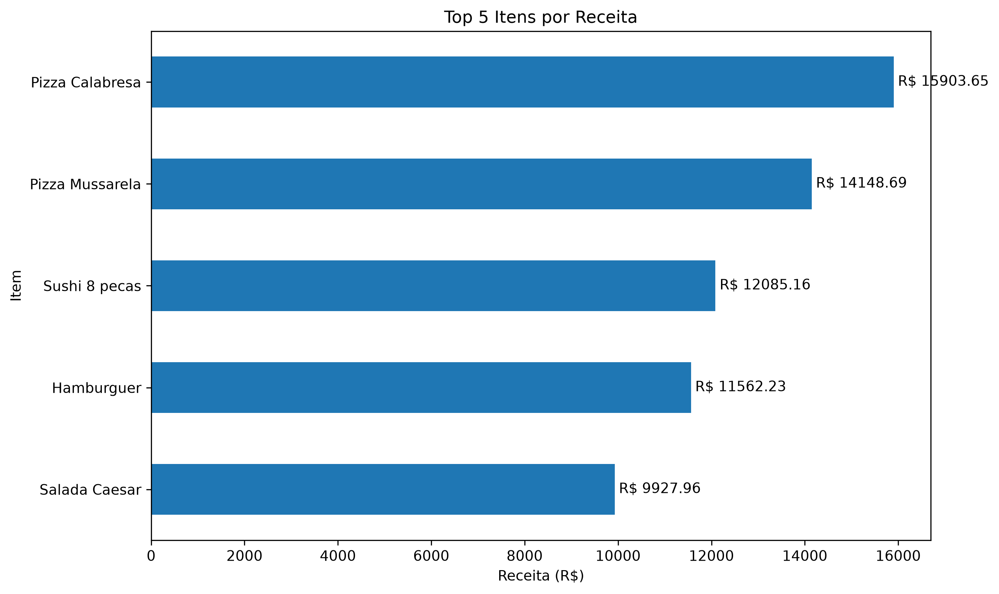

# Delivery Data Analysis

Projeto de análise de dados de pedidos de um serviço de delivery utilizando Python, Pandas, NumPy e Matplotlib.

## Objetivo

O projeto tem como objetivo explorar, tratar e analisar dados de pedidos, criando indicadores, visualizações e extraindo informações relevantes sobre vendas, produtos, categorias e comportamento ao longo do tempo.

## Tecnologias utilizadas

- Python
- Pandas
- NumPy
- Matplotlib

## Estrutura do projeto

```text
delivery-data-analysis/
├── dados/
│   ├── pedidos.csv
│   └── cardapio.csv
├── graficos/
│   ├── evolucao_receita_mensal.png
│   ├── receita_por_categoria.png
│   └── top_5_itens_receita.png
├── main.py
└── README.md
```

## Análises realizadas

O projeto inclui:

- carregamento e exploração dos dados com Pandas;
- identificação e tratamento de valores ausentes;
- criação da coluna `Receita_Item`;
- agrupamento e análise dos produtos;
- identificação dos produtos mais vendidos e com maior receita;
- análise da evolução mensal da receita;
- cruzamento dos pedidos com informações do cardápio;
- análise de receita por categoria;
- cálculo de KPIs;
- cálculo de percentis utilizando NumPy;
- criação de visualizações utilizando Matplotlib.

## Tratamento dos dados

Os valores ausentes da coluna `Quantidade` foram preenchidos com a média da própria coluna.

Os registros sem informação em `Preco_Unitario` foram removidos.

Após o tratamento, a receita de cada item foi calculada pela multiplicação da quantidade pelo preço unitário.

## Principais resultados

- Item com maior quantidade vendida: **Hamburguer**
- Item com maior receita: **Pizza Calabresa**
- Categoria com maior receita: **Salgados — R$ 53.073,30**
- Mês com maior receita: **Fevereiro de 2023 — R$ 6.646,03**
- Receita total: **R$ 122.652,59**
- Total de itens vendidos: **6.833,25**
- Número de pedidos analisados: **430**
- Ticket médio: **R$ 285,24**

Um dos principais insights da análise é que o produto com maior quantidade vendida não é necessariamente o produto responsável pela maior receita. Enquanto o **Hamburguer** liderou em quantidade, a **Pizza Calabresa** apresentou o maior faturamento.

## Visualizações

### Receita por categoria



A categoria **Salgados** apresentou a maior receita no período analisado, alcançando aproximadamente R$ 53 mil.

### Evolução mensal da receita



A análise temporal permite observar as oscilações da receita ao longo do período, com o maior resultado registrado em **fevereiro de 2023**.

### Top 5 itens por receita



A **Pizza Calabresa** apresentou a maior receita entre os produtos analisados, seguida pela Pizza Mussarela e pelo Sushi 8 peças.

## Percentis

### Preço unitário

- 25%: R$ 8,92
- 50%: R$ 13,10
- 75%: R$ 27,40

### Quantidade

- 25%: 8
- 50%: 16
- 75%: 24

## Como executar

Instale as dependências:

```bash
pip install pandas numpy matplotlib
```

Execute o projeto:

```bash
python main.py
```

Ao executar o programa, as visualizações também são salvas automaticamente na pasta `graficos`.

## Autor

Projeto desenvolvido como exercício prático durante meus estudos de Data Analytics na Rocketseat.